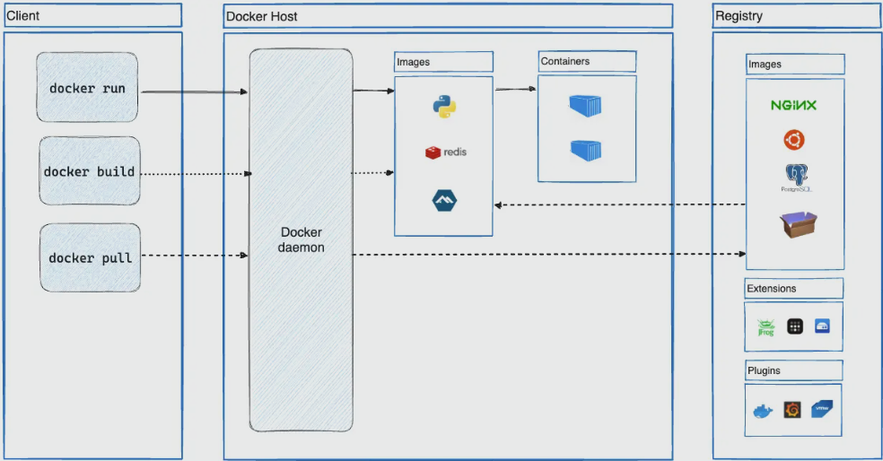

# Docker

Ví dụ bạn có 1 app dùng database là MS SQL, code PHP với web server là apache -> Khi muốn demo cho khách hàng, buộc khách hàng phải cài MS SQL, PHP và apache, đôi khi có thể khác version -> Cài đặt phức tạp

Docker gom những thứ trên thành 1 container -> tách biệt môi trường chạy code thành container để dễ quản lý, dễ share

### Docker Overview

Docker là nền tảng phần mềm cho phép bạn dựng, kiểm thử và triển khai ứng dụng một cách nhanh chóng. Docker đóng gói phần mềm vào các đơn vị tiêu chuẩn hóa được gọi là container có mọi thứ mà phần mềm cần để chạy, trong đó có thư viện, công cụ hệ thống, mã và thời gian chạy. Bằng cách sử dụng Docker, có thể nhanh chóng triển khai và thay đổi quy mô ứng dụng vào bất kỳ môi trường nào và biết chắc rằng mã của bạn sẽ chạy được.


#### Tại sao lại sử dụng Docker
- Cung cấp ứng dụng của bạn một cách nhanh chóng và tối ưu
- Deploy nhanh, dễ mở rộng.
- Chạy nhiều khối lượng công việc hơn trên cùng một phần cứng.

## Docker Architecture



Docker uses a client-server architecture. The Docker client talks to the Docker daemon, which does the heavy lifting of building, running, and distributing your Docker containers. The Docker client and daemon can run on the same system, or you can connect a Docker client to a remote Docker daemon. The Docker client and daemon communicate using a REST API, over UNIX sockets or a network interface. Another Docker client is Docker Compose, that lets you work with applications consisting of a set of containers.


### Docker daemon
The Docker daemon (dockerd) listens for Docker API requests and manages Docker objects such as images, containers, networks, and volumes. A daemon can also communicate with other daemons to manage Docker services.

### The Docker client
The Docker client (docker) is the primary way that many Docker users interact with Docker. When you use commands such as docker run, the client sends these commands to dockerd, which carries them out. The docker command uses the Docker API. The Docker client can communicate with more than one daemon.

### Docker registries
A Docker registry stores Docker images. Docker Hub is a public registry that anyone can use, and Docker looks for images on Docker Hub by default. You can even run your own private registry.

When you use the docker pull or docker run commands, Docker pulls the required images from your configured registry. When you use the docker push command, Docker pushes your image to your configured registry.

### Docker objects
When you use Docker, you are creating and using images, containers, networks, volumes, plugins, and other objects. This section is a brief overview of some of those objects.

### Image

Bao gồm OS, lib, code,... (bao gồm tất cả các thành phần cần thiết để chạy ứng dụng hoặc hệ thống)
Image run ra container.

Image có thể được coi như một "template" cho một container. Khi bạn chạy một container từ một image, Docker sẽ tạo ra một phiên bản của image đó, gọi là container. Mỗi container có thể được xem như một thể hiện cụ thể của image.

Các image trong Docker có thể được xây dựng từ Dockerfile, một tập hợp các hướng dẫn cho Docker để tạo ra một image dựa trên một image cơ sở và các tùy chọn cấu hình khác. Images cũng có thể được tải về từ Docker Hub hoặc các kho lưu trữ Docker khác, hoặc được chia sẻ giữa các nhóm phát triển và người dùng Docker.

Cách build image

```
docker build -t getting-started .
```

`Docker build`: Đây là lệnh cơ bản để bắt đầu quá trình xây dựng một Docker image.

`-t getting-started`: đặt tên cho image đó là getting-started

`.`: là đường dẫn tới thư mục chứa Dockerfile và các tài nguyên cần thiết khác để xây dựng image. Dấu chấm này chỉ định rằng Docker sẽ tìm Dockerfile trong thư mục hiện tại.

### Container

Container là một quy trình được đóng gói chạy trên máy chủ, tách biệt với tất cả các quy trình khác đang chạy trên máy chủ đó

Là một phiên bản có thể chạy được của một image. Bạn có thể tạo, bắt đầu, dừng, di chuyển hoặc xóa vùng chứa bằng API Docker hoặc CLI.

Container có tính di động, có thể chạy trên mọi hệ điều hành, có thể chạy trên máy cục bộ, máy ảo hoặc cloud. 

Cách chạy ứng dụng trong container bằng lệnh `docker run`

```
docker run -dp 127.0.0.1:3000:3000 getting-started
```

Giải thích:

-d: viết tắt của detach -> chạy container ở chế độ nền. 

-p: ánh xạ cổng của máy chủ và container theo định dạng `HOST:CONTAINER`. Nếu không có ánh xạ cổng sẽ không thể chạy ứng dụng từ máy chủ.


### Dockerfile

Là file hướng dẫn hệ thống build image


Dockerfile
```
# syntax=docker/dockerfile:1

FROM node:18-alpine
WORKDIR /app
COPY . .
RUN yarn install --production
CMD ["node", "src/index.js"]
EXPOSE 3000
```
`# syntax=docker/dockerfile:1`: chỉ định phiên bản cú pháp Dockerfile mà Docker sẽ sử dụng để phân tích file. Trong trường hợp này, nó sử dụng phiên bản 1 của cú pháp Dockerfile.

`FROM node:18-alpine`: chỉ định rằng Docker sẽ sử dụng một image có sẵn làm cơ sở cho image mới. Trong trường hợp này, image cơ sở được chọn là node:18-alpine, tức là một phiên bản của Node.js chạy trên Alpine Linux, một phiên bản nhỏ gọn của Linux.

`WORKDIR /app`: đặt thư mục làm việc trong container là `/app`, nơi mà các lệnh tiếp theo sẽ được thực thi.

`COPY . .`: sao chép tất cả các tệp và thư mục từ thư mục hiện tại của máy host (thường là thư mục chứa Dockerfile) vào thư mục làm việc trong container (/app).

`run yarn install --production`: chạy lệnh yarn install --production để cài đặt các dependencies của ứng dụng Node.js. Tùy chọn --production chỉ định rằng chỉ các dependencies cần thiết cho production sẽ được cài đặt, bỏ qua các dependencies được định nghĩa cho môi trường phát triển.

`CMD ["node", "src/index.js"]`: chỉ định lệnh mặc định được thực thi khi container được chạy. Trong trường hợp này, nó là node src/index.js, tức là chạy file JavaScript index.js trong thư mục src của ứng dụng Node.js.

`EXPOSE 3000`: chỉ định rằng container sẽ lắng nghe trên cổng 3000. Tuy nhiên, lệnh này không mở cổng này trên host, nó chỉ là một chỉ thị để thông báo về cổng mà ứng dụng trong container sẽ lắng nghe. Để kết nối với container trên cổng này từ bên ngoài, bạn cần phải ánh xạ cổng container với một cổng trên host khi khởi chạy container.

### Docker Hub

Docker Hub là một kho lưu trữ trực tuyến cho các container images được tạo và chia sẻ bởi cộng đồng Docker. Docker Hub cho phép người dùng tìm kiếm, tải xuống, lưu trữ và chia sẻ các images của container

### Docker-compose


Docker Compose là một công cụ của Docker được sử dụng để quản lý và triển khai ứng dụng đa container. Nó cho phép bạn định nghĩa cấu trúc của ứng dụng dựa trên container trong một file cấu hình duy nhất `docker-compose.yml`, sau đó sử dụng file này để tạo và quản lý nhiều container cùng một lúc.

