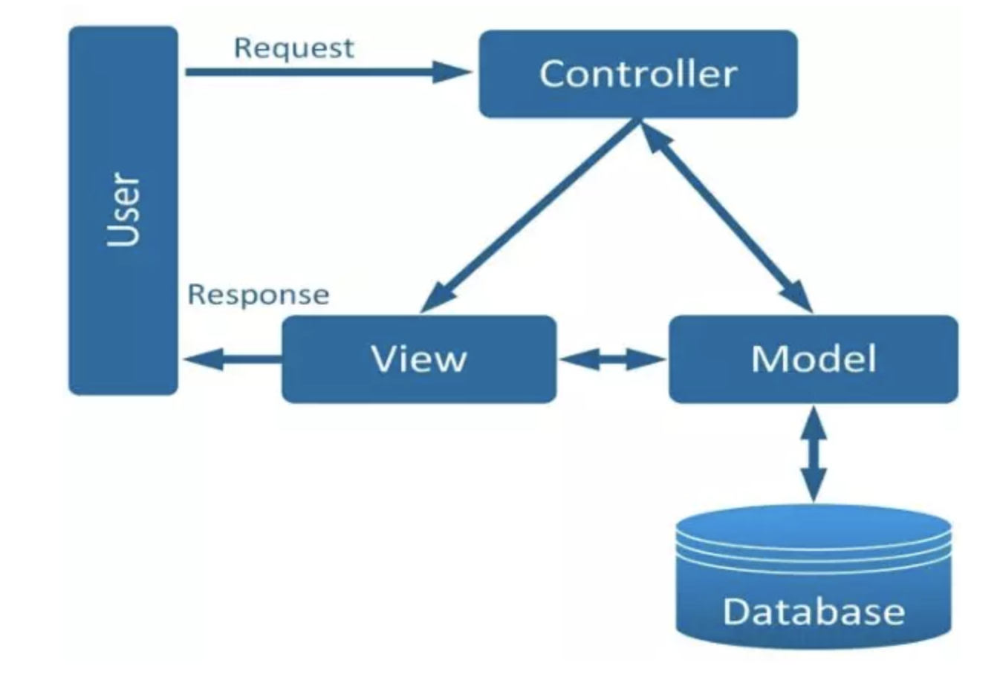

# MVC

Mô hình MVC (Model – View – Controller) là một kiến trúc phần mềm hay mô hình thiết kế được sử dụng trong kỹ thuật phần mềm. Nó giúp tách ứng dụng thành 3 phần khác nhau: Model (Xử lý dữ liệu), View (Hiển thị) và Controller (Điều khiển). Mỗi thành phần có một nhiệm vụ riêng biệt và độc lập với nhau.

- Model

> Dùng để cung cấp dữ liệu, thực hiện kết nối, các thao tác với dữ liệu như: thêm, sửa, xóa, lọc ,… truy vấn dữ liệu trong database, tương tác với dữ liệu hay hệ quản trị cơ sở dữ liệu.

- View

> Đảm nhận việc hiển thị thông tin, giúp người dùng tương tác với hệ thống. Hiểu một cách đơn giản, nó là tập hợp các file HTML.

- Controller
  > Giữ nhiệm vụ tiếp nhận điều hướng các yêu cầu từ người dùng, giúp lấy dữ liệu đúng với những thông tin cần thiết nhờ vào các nghiệp vụ lớp Model cung cấp và hiển thị các dữ liệu đó ra cho người dùng.

Ví dụ đơn giản để mô tả lại luồng sự kiện được xử lý trong MVC:

> User tương tác với View như nhập form, click submit.
> Controller nhận và điều hướng chúng đến đúng phương thức xử lý ở Model.
> Model nhận thông tin và thực thi các yêu cầu.
> Khi Model hoàn tất xử lý, View sẽ nhận kết quả từ Model và hiển thị lại cho người dùng.

## Ưu điểm của mô hình MVC

- Tiết kiệm băng thông: MVC rất nhẹ và giúp tiết kiệm diện tích của băng thông. Khi cần gửi và nhập dữ liệu liên tục, người dùng dễ dàng sử dụng ứng dụng trên web, từ đó khiến trang chủ hoạt động ổn định và mượt mà.
- Kiểm tra nhanh chóng: Nhờ có MVC, các công việc kiểm tra, rà soát lỗi, đảm bảo chất lượng của phần mềm trước khi tới tay người dùng trở nên đơn giản hơn.
- Điều khiển: Mô hình kiến trúc phần mềm tương thích với các nền tảng các ngôn ngữ lập trình như HTML, CSS, Javascript,… dựa trên nhiều hình thức khác nhau.
- Chức năng Separation of Concern (SOC): MVC cho phép lập trình viên phân tách rõ ràng cấu trúc model, data, giao diện và nghiệp vụ.
- Tính kết hợp: Dễ dàng viết code trên web khi tích hợp mô hình MVC nhằm giảm tải dữ liệu server.
- Tính đơn giản: MVC có cấu hình tương đối đơn giản và dễ dàng sử dụng ngay khi bạn không phải là dân chuyên.

## Hạn chế

- Gây tốn thời gian khi thực hiện vào các dự án nhỏ, chiếm nhiều diện tích trong quá trình phát triển và trung chuyển các dữ liệu. Do đó, mô hình này chỉ phù hợp ứng dụng cho các dự án lớn.
- Do mô hình mất cân bằng nên dễ khiến Model gặp lỗi, khó phát triển và sửa chữa từ đó các lập trình viên (developer) lo mảng Model sẽ phải làm việc vất vả cũng như cần trình độ chuyên môn cao hơn.

## Tại sao nên sử dụng mô hình MVC

**Sự độc lập và phát triển song song**

> Vì mỗi thành phần trong MVC có nhiệm vụ riêng và độc lập với nhau, nên mỗi developer có thể đảm nhiệm một thành phần và không ảnh hưởng đến nhau khiến quá trình phát triển diễn ra nhanh chóng, dễ dàng

**Khả năng cung cấp nhiều chế độ view**

> Trong mô hình MVC, bạn có thể tạo nhiều View cho chỉ một mô hình. Ngày nay, nhu cầu có thêm nhiều cách mới để truy cập ứng dụng và đang ngày càng tăng.

**Các sửa đổi không ảnh hưởng đến toàn bộ mô hình**

> Việc thêm một kiểu view mới trong MVC rất đơn giản. Vì phần Model không phụ thuộc vào phần View. Do đó, bất kỳ thay đổi nào trong Model sẽ không ảnh hưởng đến toàn bộ kiến trúc.

**MVC Model trả về dữ liệu mà không cần định dạng**

> MVC pattern có thể trả về dữ liệu mà không cần áp dụng bất kỳ định dạng nào. Do đó, các thành phần giống nhau có thể được sử dụng với bất kỳ giao diện nào.

> Ví dụ: tất cả loại dữ liệu đều có thể được định dạng bằng HTML. Ngoài ra, nó cũng có thể được định dạng bằng Macromedia Flash hay Dream Viewer.

**Hỗ trợ kỹ thuật Asynchronous**

>Kiến trúc MVC có thể được tích hợp với cả JavaScript Framework. Có nghĩa là, các ứng dụng MVC có thể hoạt động ngay cả với các file PDF, trình duyệt riêng cho web hay các widget trên desktop.