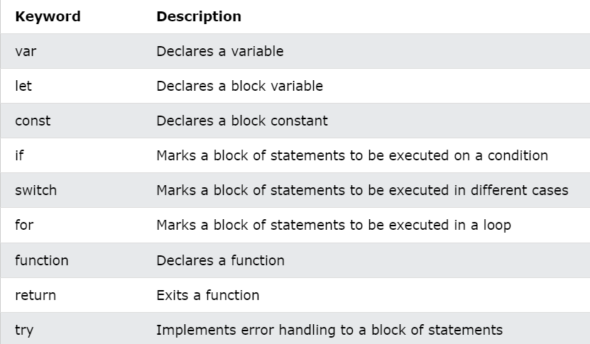

# Research JS6

ES6 or the ECMAScript 2015 is the 6th and major edition of the ECMAScript language specification standard. It defines the standard for the implementation of JavaScript and it has become much more popular than the previous edition ES5.

ES6 comes with significant changes to the JavaScript language. It brought several new features like, let and const keyword, rest and spread operators, template literals, classes, modules and many other enhancements to make JavaScript programming easier and more fun. 

**Brower Support for ES6**
---
  
- Chrome 51

- Edge 15

- Firefox 54

- Safari 10

- Opera 38


**Output**
---

We used `console.log` to print text in the development console:
```js
console.log("My name is Hao"); // My name is Hao
```

Another way of creating output in a popup-box:
```js
alert("My name is Hao");
```

**Input**
---

Easy way to get input: use the `prompt` function:

```js
name = prompt("Enter your name:");
console.log(name);
```


**Operators**
---

Operator are how we perform actions on variables and values.

Here are some of the most common operators in Javascript:

* Assignment: `=` as in `a = 2`.
* Math: `+` (addition), `-` (subtraction), `*` (multiplication), and `/` (division), as in `a * 3`.
* Compound Assignment: `+=`, `-=`, `*=`, and `/=` are compound operators that combine a math operation with assignment, as in `a += 2` (same as `a = a + 2`).
* Increment/Decrement: `++` (increment), `--` (decrement), as in `a++` (similar to `a = a + 1`).
* Object Property Access: `.` as in `console.log()`.

   Objects are values that hold other values at specific named locations called properties. `obj.a` means an object value called `obj` with a property of the name `a`. Properties can alternatively be accessed as `obj["a"]`
* Equality: `==` (loose-equals), `===` (strict-equals), `!=` (loose not-equals), `!==` (strict not-equals), as in `a == b`.

* Comparison: `<` (less than), `>` (greater than), `<=` (less than or loose-equals), `>=` (greater than or loose-equals), as in `a <= b`.


* Logical: `&&` (and), `||` (or), as in `a || b` that selects either `a` *or* `b`.

   These operators are used to express compound conditionals (see "Conditionals"), like if either `a` *or* `b` is true.

**Value & Type**
---

These different representations for values are called *types* in programming terminology. JavaScript has built-in types for each of these so called *primitive* values:

* When you need to do math, you want a `number`.
* When you need to print a value on the screen, you need a `string` (one or more characters, words, sentences).
* When you need to make a decision in your program, you need a `boolean` (`true` or `false`).

Values that are included directly in the source code are called *literals*. `string` literals are surrounded by double quotes `"..."` or single quotes (`'...'`) -- the only difference is stylistic preference. `number` and `boolean` literals are just presented as is (i.e., `42`, `true`, etc.).


```js
"I am a string";
'I am also a string';

42;

true;
false;
```

**Converting Between Types**
---

If you have a `number` but need to print it on the screen, you need to convert the value to a `string`, and in JavaScript this conversion is called "coercion." Similarly, if someone enters a series of numeric characters into a form on an ecommerce page, that's a `string`, but if you need to then use that value to do math operations, you need to *coerce* it to a `number`.

JavaScript provides several different facilities for forcibly coercing between *types*. For example:

```js
var a = "42";
var b = Number( a );

console.log( a );	// "42"
console.log( b );	// 42
```


**Code Comments**
---

```js
let x = 5;     // This will be executed
// x = 6       // This will NOT be executed
```

Code comment is ignored by the compiler.

```js
// This is a single-line comment

/* But this is
       a multiline
             comment.
                      */
```

**Statements**
---

JS statements are composed of: values, operators, expressions, keywords and comments.

Semicolons `;` separate JS statement. Add a semicolon at the end of each executable statement
```
let a, b;
a = 2;
b = 3;
```

**Keywords**
---



**Variables**
---

Variables are Containers for Storing Data.
JavaScript Variables can be declared in 4 ways:
- Automatically
- Using `var`
- Using `let` (The `let` keyword was introduced in ES6 (2015))
- Using `const`

In this first example, x, y, and z are undeclared variables.

They are automatically declared when first used:

```js
x = 5;          // x stores the value 5
y = 6;          // y stores the value 6
z = x + y;      // z stores the value 11
```

__Note__:

- The var keyword was used in all JavaScript code from 1995 to 2015.
- The let and const keywords were added to JavaScript in 2015.
- The var keyword should only be used in code written for older browsers.

Example using `let`:

```js
let a = 5;
let b = 10;
let c = a + b;
```

**Different between `let` and `var`**
- Variables declared by let are only available inside the block where they’re defined.
- Variables declared by var are available throughout the function in which they’re declared.

```js
function varScoping() {
  var x = 1;

  if (true) {
    var x = 2;
    console.log(x); // will print 2
  }

  console.log(x); // will print 2
}

function letScoping() {
  let x = 1;

  if (true) {
    let x = 2;
    console.log(x); // will print 2
  }

  console.log(x); // will print 1
}
```

Creating a variable in JavaScript is called "declaring" a variable.

You declare a JavaScript variable with the `var` or the `let` keyword:
```js
var name;
```
or
```js
let name;
```

After the declaration, the variable has no value (technically it is undefined).

To assign a value to the variable, use the equal sign:
```js
let name = "Duong Hao";
```

**One Statement, Many Variables**
You can declare many variables in one statement.

Start the statement with let and separate the variables by comma `,`:

```js
let name = "Duong Hao", age = 20;
```

**Re-Declaring JavaScript Variables**

If you re-declare a JavaScript variable declared with var, it will not lose its value.

The variable name will still have the value "Duong Hao" after the execution of these statements:
```js
var name = "Duong Hao";
var name;
```

Note: You cannot re-declare a variable declared with `let` or `const`.

This will not work:

```js
let carName = "Volvo";
let carName;
```

**Arithmetic**

```js
let x = 2 + 3 + 5          // x = 10
let y = "Duong" + " Hao"   // y = "Duong Hao"
let z = "5" + 2 + 3;       // z = 523
let t = 2 + 3 + "5";       // t = 55
```

**Let**

- The let keyword was introduced in ES6 (2015)
- Variables declared with let have Block Scope
- Variables declared with let must be Declared before use
- Variables declared with let cannot be Redeclared in the same scope


- Before ES6 (2015), JavaScript did not have Block Scope.
- JavaScript had Global Scope and Function Scope.
- ES6 introduced the two new JavaScript keywords: `let` and `const`.

Variables declared inside a { } block cannot be accessed from outside the block:
```js
{
    let x = 2;
}
// x can NOT used here
```

**Global Scope**

Variables declared with the var always have `Global Scope`.

Variables declared with the var keyword can NOT have block scope:
```js
{
  var x = 2;
}
// x CAN be used here
```

**Const**

- The const keyword was introduced in ES6 (2015)
- Variables defined with const cannot be Redeclared
- Variables defined with const cannot be Reassigned
- Variables defined with const have Block Scope

**Data types**
---
**JavaScript has 8 Datatypes**
1. String
2. Number
3. Bigint
4. Boolean
5. Undefined
6. Null
7. Symbol
8. Object

**The Object Datatype**

The object data type can contain:

1. An object
2. An array
3. A date

