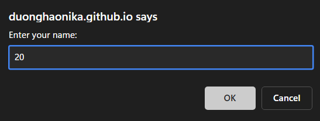
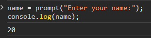

# Research JS6

Javascript ES6 (also known as ECMAScript 2015 or ECMAScript6) is the six edition of the ECMAScript standard. ECMAScript is the official name for the Javascript language specification.

**Brower Support for ES6**
---
  

- Chrome 51

- Edge 15

- Firefox 54

- Safari 10

- Opera 38


**Output**

We used `console.log` to print text in the development console:
```
console.log("My name is Hao"); // My name is Hao
```

Another way of creating output in a popup-box:
```
alert("My name is Hao");
```

**Input**

Easy way to get input: use the `prompt` function:

```
name = prompt("Enter your name:");
console.log(name);
```




**Operators**

Operator are how we perform actions on variables and values.

Here are some of the most common operators in Javascript:

* Assignment: `=` as in `a = 2`.
* Math: `+` (addition), `-` (subtraction), `*` (multiplication), and `/` (division), as in `a * 3`.
* Compound Assignment: `+=`, `-=`, `*=`, and `/=` are compound operators that combine a math operation with assignment, as in `a += 2` (same as `a = a + 2`).
* Increment/Decrement: `++` (increment), `--` (decrement), as in `a++` (similar to `a = a + 1`).
* Object Property Access: `.` as in `console.log()`.

   Objects are values that hold other values at specific named locations called properties. `obj.a` means an object value called `obj` with a property of the name `a`. Properties can alternatively be accessed as `obj["a"]`. See Chapter 2.
* Equality: `==` (loose-equals), `===` (strict-equals), `!=` (loose not-equals), `!==` (strict not-equals), as in `a == b`.

   See "Values & Types" and Chapter 2.
* Comparison: `<` (less than), `>` (greater than), `<=` (less than or loose-equals), `>=` (greater than or loose-equals), as in `a <= b`.

   See "Values & Types" and Chapter 2.
* Logical: `&&` (and), `||` (or), as in `a || b` that selects either `a` *or* `b`.

   These operators are used to express compound conditionals (see "Conditionals"), like if either `a` *or* `b` is true.