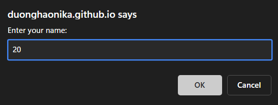
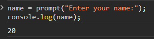
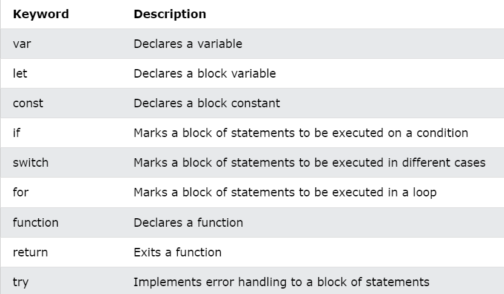

# Research JS6

ES6 or the ECMAScript 2015 is the 6th and major edition of the ECMAScript language specification standard. It defines the standard for the implementation of JavaScript and it has become much more popular than the previous edition ES5.

ES6 comes with significant changes to the JavaScript language. It brought several new features like, let and const keyword, rest and spread operators, template literals, classes, modules and many other enhancements to make JavaScript programming easier and more fun. 

**Brower Support for ES6**
---
  
- Chrome 51

- Edge 15

- Firefox 54

- Safari 10

- Opera 38

**let and const keywords**

"const" enables the users to define constants. Variables were previously declared using "var" which had function scope and were hoisted to the top. It means that a variable can be used before declaration. But, the "let" variables and constants have block scope which is surrounded by curly-braces "{}" and cannot be used before declaration.

```js
let i = 10;
console.log(i);   //Output 10

const PI = 3.14;
console.log(PI);  //Output 3.14
```

**Arrow Functions**

ES6 provides a feature known as Arrow Functions. It provides a more concise syntax for writing function expressions by removing the "function" and "return" keywords.

Arrow functions are defined using the fat arrow (=>) notation.

```js
// Arrow function
let sumOfTwoNumbers = (a, b) => a + b;
console.log(sum(10, 20)); // Output 30
```

**Multi-line Strings**

ES6 also provides Multi-line Strings. Users can create multi-line strings by using back-ticks(`).

```js
let info = `Duong Hao
            D22
            Ha Nam`
```

**Default Parameters**

In ES6, users can provide the default values right in the signature of the functions

```js
//ES6
let calculateArea = function(height = 100, width = 50) {  
    return heght * width;
}

//ES5
var calculateArea = function(height, width) {  
   height =  height || 50;
   width = width || 80;
   return heght * width;
}
```

**Template Literals**

ES6 introduces very simple string templates along with placeholders for the variables. The syntax for using the string template is ${PARAMETER} and is used inside of the back-ticked string.

```js
let ten = "Hao"
let name = `My name is ${ten}` // My name is Hao
```

**Destructuring Assignment**

Destructuring is one of the most popular features of ES6. The destructuring assignment is an expression that makes it easy to extract values from arrays, or properties from objects, into distinct variables.

There are two types of destructuring assignment expressions, namely, Array Destructuring and Object Destructuring

```js
//Array Destructuring
let fruits = ["Apple", "Banana"];
let [a, b] = fruits; // Array destructuring assignment
console.log(a, b);

//Object Destructuring
let person = {name: "Peter", age: 28};
let {name, age} = person; // Object destructuring assignment
console.log(name, age);
```

**Enhanced Object Literals**

ES6 provides enhanced object literals which make it easy to quickly create objects with properties inside the curly braces.

```js
function getInfo(name, age) {
   return {
      name, age
   }
}
let hao = getInfo("Hao, 20");
```

**Classes**

More intuitive, OOP-style and boilerplate-free classes.

```js
class Shape {
    constructor (id, x, y) {
        this.id = id
        this.move(x, y)
    }
    move (x, y) {
        this.x = x
        this.y = y
    }
}
```

Class Inheritance

```js
class Rectangle extends Shape {
    constructor (id, x, y, width, height) {
        super(id, x, y)
        this.width  = width
        this.height = height
    }
}
class Circle extends Shape {
    constructor (id, x, y, radius) {
        super(id, x, y)
        this.radius = radius
    }
}
```

**Base Class Access**

Intuitive access to base class constructor and methods.

```js
class Shape {
    …
    toString () {
        return `Shape(${this.id})`
    }
}
class Rectangle extends Shape {
    constructor (id, x, y, width, height) {
        super(id, x, y)
        …
    }
    toString () {
        return "Rectangle > " + super.toString()
    }
}
class Circle extends Shape {
    constructor (id, x, y, radius) {
        super(id, x, y)
        …
    }
    toString () {
        return "Circle > " + super.toString()
    }
}
```

**Static Members**

Simple support for static class members.

```js
class Rectangle extends Shape {
    …
    static defaultRectangle () {
        return new Rectangle("default", 0, 0, 100, 100)
    }
}
class Circle extends Shape {
    …
    static defaultCircle () {
        return new Circle("default", 0, 0, 100)
    }
}
var defRectangle = Rectangle.defaultRectangle()
var defCircle    = Circle.defaultCircle()
```
Getter/Setter

```js
class Rectangle {
    constructor (width, height) {
        this._width  = width
        this._height = height
    }
    set width  (width)  { this._width = width               }
    get width  ()       { return this._width                }
    set height (height) { this._height = height             }
    get height ()       { return this._height               }
    get area   ()       { return this._width * this._height }
}
var r = new Rectangle(50, 20)
r.area === 1000
```

**Modules**

We can use the "import" or "export" statement in a module to import or export variables, functions, classes or any other component from/to different files and modules.

`person.js`

```js
const name = "Hao";
const age = 20;

export {name, age};
```

`main.js`

```js
import { name, age } from "./person.js";
console.log(name;) // Hao
```

**Promises**

In ES6, Promises are used for asynchronous execution

```js
/* Co 3 trang thai cua promise
    1. pending(ro ri bo nho,...)
    2. Fullfilled (resolve)
    3. Reject     (reject)
*/
var promise = new Promise(
    // Executor
    function(resolve, reject){
      //Logic
      //Thanh cong: resolve
      //That bai: reject
    }
)

// Co 3 phuong thuc cua promise

promise 
      .then(function(){
          // duoc goi khi resolve dc goi
          console.log("Succesfully");
      })
      .catch(function(){
          // duoc goi khi reject duoc goi
          console.log('Failure');
      })
      .finally(function(){
          // duoc goi khi resolve hoac reject
          console.log('Done!');
      })

```


**JS BASIC**
---


**Output**
---

We used `console.log` to print text in the development console:
```js
console.log("My name is Hao"); // My name is Hao
```

Another way of creating output in a popup-box:
```js
alert("My name is Hao");
```

**Input**
---

Easy way to get input: use the `prompt` function:

```js
name = prompt("Enter your name:");
console.log(name);
```




**Operators**
---

Operator are how we perform actions on variables and values.

Here are some of the most common operators in Javascript:

* Assignment: `=` as in `a = 2`.
* Math: `+` (addition), `-` (subtraction), `*` (multiplication), and `/` (division), as in `a * 3`.
* Compound Assignment: `+=`, `-=`, `*=`, and `/=` are compound operators that combine a math operation with assignment, as in `a += 2` (same as `a = a + 2`).
* Increment/Decrement: `++` (increment), `--` (decrement), as in `a++` (similar to `a = a + 1`).
* Object Property Access: `.` as in `console.log()`.

   Objects are values that hold other values at specific named locations called properties. `obj.a` means an object value called `obj` with a property of the name `a`. Properties can alternatively be accessed as `obj["a"]`
* Equality: `==` (loose-equals), `===` (strict-equals), `!=` (loose not-equals), `!==` (strict not-equals), as in `a == b`.

* Comparison: `<` (less than), `>` (greater than), `<=` (less than or loose-equals), `>=` (greater than or loose-equals), as in `a <= b`.


* Logical: `&&` (and), `||` (or), as in `a || b` that selects either `a` *or* `b`.

   These operators are used to express compound conditionals (see "Conditionals"), like if either `a` *or* `b` is true.

**Value & Type**
---

These different representations for values are called *types* in programming terminology. JavaScript has built-in types for each of these so called *primitive* values:

* When you need to do math, you want a `number`.
* When you need to print a value on the screen, you need a `string` (one or more characters, words, sentences).
* When you need to make a decision in your program, you need a `boolean` (`true` or `false`).

Values that are included directly in the source code are called *literals*. `string` literals are surrounded by double quotes `"..."` or single quotes (`'...'`) -- the only difference is stylistic preference. `number` and `boolean` literals are just presented as is (i.e., `42`, `true`, etc.).


```js
"I am a string";
'I am also a string';

42;

true;
false;
```

**Converting Between Types**
---

If you have a `number` but need to print it on the screen, you need to convert the value to a `string`, and in JavaScript this conversion is called "coercion." Similarly, if someone enters a series of numeric characters into a form on an ecommerce page, that's a `string`, but if you need to then use that value to do math operations, you need to *coerce* it to a `number`.

JavaScript provides several different facilities for forcibly coercing between *types*. For example:

```js
var a = "42";
var b = Number( a );

console.log( a );	// "42"
console.log( b );	// 42
```


**Code Comments**
---

```js
let x = 5;     // This will be executed
// x = 6       // This will NOT be executed
```

Code comment is ignored by the compiler.

```js
// This is a single-line comment

/* But this is
       a multiline
             comment.
                      */
```

**Statements**
---

JS statements are composed of: values, operators, expressions, keywords and comments.

Semicolons `;` separate JS statement. Add a semicolon at the end of each executable statement
```js
let a, b;
a = 2;
b = 3;
```

**Keywords**
---



**Variables**
---

Variables are Containers for Storing Data.
JavaScript Variables can be declared in 4 ways:
- Automatically
- Using `var`
- Using `let` (The `let` keyword was introduced in ES6 (2015))
- Using `const` (The `const` keyword was introduced in ES6 (2015))

In this first example, x, y, and z are undeclared variables.

They are automatically declared when first used:

```js
x = 5;          // x stores the value 5
y = 6;          // y stores the value 6
z = x + y;      // z stores the value 11
```

__Note__:

- The var keyword was used in all JavaScript code from 1995 to 2015.
- The let and const keywords were added to JavaScript in 2015.
- The var keyword should only be used in code written for older browsers.

Example using `let`:

```js
let a = 5;
let b = 10;
let c = a + b;
```

**Different between `let` and `var`**
- Variables declared by let are only available inside the block where they’re defined.
- Variables declared by var are available throughout the function in which they’re declared.

```js
function varScoping() {
  var x = 1;

  if (true) {
    var x = 2;
    console.log(x); // will print 2
  }

  console.log(x); // will print 2
}

function letScoping() {
  let x = 1;

  if (true) {
    let x = 2;
    console.log(x); // will print 2
  }

  console.log(x); // will print 1
}
```

Creating a variable in JavaScript is called "declaring" a variable.

You declare a JavaScript variable with the `var` or the `let` keyword:
```js
var name;
```
or
```js
let name;
```

After the declaration, the variable has no value (technically it is undefined).

To assign a value to the variable, use the equal sign:
```js
let name = "Duong Hao";
```

**One Statement, Many Variables**
You can declare many variables in one statement.

Start the statement with let and separate the variables by comma `,`:

```js
let name = "Duong Hao", age = 20;
```

**Re-Declaring JavaScript Variables**

If you re-declare a JavaScript variable declared with var, it will not lose its value.

The variable name will still have the value "Duong Hao" after the execution of these statements:
```js
var name = "Duong Hao";
var name;
```

Note: You cannot re-declare a variable declared with `let` or `const`.

This will not work:

```js
let carName = "Volvo";
let carName;
```

**Arithmetic**

```js
let x = 2 + 3 + 5          // x = 10
let y = "Duong" + " Hao"   // y = "Duong Hao"
let z = "5" + 2 + 3;       // z = 523
let t = 2 + 3 + "5";       // t = 55
```

**Let**

- The let keyword was introduced in ES6 (2015)
- Variables declared with let have Block Scope
- Variables declared with let must be Declared before use
- Variables declared with let cannot be Redeclared in the same scope


- Before ES6 (2015), JavaScript did not have Block Scope.
- JavaScript had Global Scope and Function Scope.
- ES6 introduced the two new JavaScript keywords: `let` and `const`.

Variables declared inside a { } block cannot be accessed from outside the block:
```js
{
    let x = 2;
}
// x can NOT used here
```

**Global Scope**

Variables declared with the var always have `Global Scope`.

Variables declared with the var keyword can NOT have block scope:
```js
{
  var x = 2;
}
// x CAN be used here
```

**Const**

- The const keyword was introduced in ES6 (2015)
- Variables defined with const cannot be Redeclared
- Variables defined with const cannot be Reassigned
- Variables defined with const have Block Scope

**Data types**
---
**JavaScript has 6 basic Datatypes**
1. String
2. Number
3. Boolean
4. Array
5. Undefined
6. Null
7. Object

**The Object Datatype**

The object data type can contain:

1. An object
2. An array
3. A date

**JavaScript Types are Dynamic**
```js
let x;       // Now x is undefined
x = 5;       // Now x is a Number
x = "John";  // Now x is a String
```
**JavaScript Strings**

Strings are written with quotes. You can use single or double quotes:
```js
// Using double quotes:
let carName1 = "Volvo XC60";

// Using single quotes:
let carName2 = 'Volvo XC60';
```

**JavaScript Numbers**

All JavaScript numbers are stored as decimal numbers (floating point).

Numbers can be written with, or without decimals:
```js
// With decimals:
let x1 = 34.00;

// Without decimals:
let x2 = 34;
```

Javascript numbers are always one type:
double (64-bit floating point).

**JavaScript Booleans**

Booleans can only have two values: `true` or `false`
```js
let x = 5;
let y = 5;
let z = 6;
(x == y)       // Returns true
(x == z)       // Returns false
```

**JavaScript Arrays**

```js
const cars = ["Saab", "Volvo", "BMW"];
```

**JavaScript Objects**

JavaScript objects are written with curly braces {}.

Object properties are written as name:value pairs, separated by commas.

```js
const person = {firstName:"John", lastName:"Doe", age:50, eyeColor:"blue"};
```

**Undefined**

In JavaScript, a variable without a value, has the value undefined. The type is also undefined.

```js
let car;    // Value is undefined, type is undefined
```

Any variable can be emptied, by setting the value to undefined. The type will also be undefined.

```js
car = undefined;    // Value is undefined, type is undefined
```

**JavaScript Functions**
---

A JavaScript function is a block of code designed to perform a particular task.

A JavaScript function is executed when "something" invokes it (calls it).

**JavaScript Function Syntax**

A JavaScript function is defined with the function keyword, followed by a name, followed by parentheses ().

Function names can contain letters, digits, underscores, and dollar signs (same rules as variables).

The parentheses may include parameter names separated by commas:
(parameter1, parameter2, ...)

The code to be executed, by the function, is placed inside curly brackets: {}

```js
function name(parameter1, parameter2, parameter3) {
  // code to be executed
}
```

In the ES6 version, you can use arrow function to create function expressions. 

```js
// function expression
let x = function(x, y){
    return x * y;
}
```

can be written as

```js
// function expression using arrow function
let x = (x, y) => x * y;
```

Function in JS don't need to return a value.

**Arrays**
---
An array is a special variable, which can hold more than one value

It is a common practice to declare arrays with the const keyword.

```js
const cars = ["Saab", "Volvo", "BMW"];
```

Note: Array indexes start with 0.

[0] is the first element. [1] is the second element.

**Changing an Array Element**

```js
const cars = ["Saab", "Volvo", "BMW"];
let car = cars[0];  // car = "Saab"
```

Array can have any element with difference type

**Converting an Array to a String**

```js
const fruits = ["Banana", "Orange", "Apple", "Mango"];
let str = fruits.toString();
// str = Banana,Orange,Apple,Mango
```

**Adding Array Elements**

The easiest way to add a new element to an array is using the push() method:

```js
const fruits = ["Banana", "Orange", "Apple"];
fruits.push("Lemon");  // Adds a new element (Lemon) to fruits
```

**The length Property**
```js
const fruits = ["Banana", "Orange", "Apple", "Mango"];
let size = fruits.length; // 4
```

**JavaScript Array join()**

The join() method also joins all array elements into a string.

It behaves just like toString(), but in addition you can specify the separator:

```js
const fruits = ["Banana", "Orange", "Apple", "Mango"];
document.getElementById("demo").innerHTML = fruits.join(" * ");
```

**JavaScript Array pop()**

The pop() method removes the last element from an array:

```js
const fruits = ["Banana", "Orange", "Apple", "Mango"];
fruits.pop();
```

The pop() method returns the value that was "popped out":

```js
const fruits = ["Banana", "Orange", "Apple", "Mango"];
let fruit = fruits.pop(); // fruit = "Mango"
```

**JavaScript Array delete()**

Using delete() leaves undefined holes in the array.

```js
const fruits = ["Banana", "Orange", "Apple", "Mango"];
delete fruits[0];
```

**Sorting an Array**

The sort() method sorts an array alphabetically:

```js
const a = [3, 4, 1, 2];
fruits.sort();
```

**Reversing an Array**

```js
const a = [3, 4, 1, 2];
fruits.reverse();
```

**The Compare Function**

```js
function(a, b){return a - b}
```

When the sort() function compares two values, it sends the values to the compare function, and sorts the values according to the returned (negative, zero, positive) value.

If the result is negative, a is sorted before b.

If the result is positive, b is sorted before a.

If the result is 0, no changes are done with the sort order of the two values.

```js
const a = [1, 2, 3, 4];
a.sort(function(a, b) {return b - a}); // 4 3 2 1
```

**JavaScript condition**
---

```js
if (condition1) {
  //  block of code to be executed if condition1 is true
} else if (condition2) {
  //  block of code to be executed if the condition1 is false and condition2 is true
} else {
  //  block of code to be executed if the condition1 is false and condition2 is false
}
```

**switch-case**
```js
switch(expression) {
  case x:
    // code block
    break;
  case y:
    // code block
    break;
  default:
    // code block
}
```

The default case does not have to be the last case in a switch block

**JavaScript For Loop**
---

**for**
```js
for (expression 1; expression 2; expression 3) {
  // code block to be executed
}
```

expression 1, 2, 3 can be empty

while/do-while is similar

**for in**

The JavaScript for in statement loops through the properties of an Object:

```js
for (variable in array) {
  code
}
```

**Array.forEach()**

The forEach() method calls a function (a callback function) once for each array element.

```js
const numbers = [45, 4, 9, 16, 25];

let txt = "";
numbers.forEach(myFunction);

function myFunction(value, index, array) {
  txt += value;
}
```

**for of**

The JavaScript for of statement loops through the values of an iterable object.

It lets you loop over iterable data structures such as Arrays, Strings, Maps, NodeLists, and more:

```js
for (variable of iterable) {
  // code block to be executed
}
```

**String**
---

```js
let a = "This is a String";
let b = 'Here is a String"
```

**Methods**

- charAt(): Returns the character at a specified index (position)
- charCodeAt(): Returns the Unicode of the character at a specified index
- concat(): Returns two or more joined strings
```js
let a = "AB";
let b = "CD"
let c = a.concat(b);  // c = "ABCD"
```

- indexOf(): Returns the index (position) of the first occurrence of a value in a string
- lastIndexOf(): Returns the index (position) of the last occurrence of a value in a string
- length: return the length of string
- split(): Splits a string into an array of substrings, returns the new array, does not change the original string
```js
const a = "Duong Quang Hao";
let arr = a.split();
```

- substring():
```js
let text = "Hello world!";
let result = text.substring(1, 4); // ell
```

- toLowerCase();
- toUpperCase();
- match(): 
- search(): Searches a string for a value, or regular expression, and returns the index (position) of the match
- replace()
- replaceAll()

