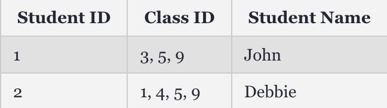

# N-N Database Relationship

Mối quan hệ nhiều-nhiều xảy ra khi nhiều bản ghi trong một bảng được liên kết với nhiều bản ghi trong một bảng khác. Ví dụ: tồn tại mối quan hệ nhiều-nhiều giữa khách hàng và sản phẩm: khách hàng có thể mua nhiều sản phẩm khác nhau và nhiều sản phẩm có thể được mua bởi nhiều khách hàng.

Các hệ thống cơ sở dữ liệu quan hệ thường không cho phép triển khai mối quan hệ nhiều-nhiều trực tiếp giữa hai bảng. Ví dụ về việc theo dõi hóa đơn. Nếu có nhiều hóa đơn có cùng số hóa đơn và một trong những khách hàng của bạn hỏi về số hóa đơn đó thì bạn sẽ không biết họ đang đề cập đến số hóa đơn nào. Đây là một lý do để chỉ định một giá trị duy nhất cho mỗi hóa đơn.

Chúng ta không thể thêm khóa chính của bảng này vào bảng kia hoặc cả hai, vì điều này chỉ lưu trữ một mối quan hệ duy nhất và chúng ta cần nhiều mối quan hệ.

Một ví dụ điển hình về mối quan hệ nhiều-nhiều là mối quan hệ giữa sinh viên và lớp học. Một học viên có thể đăng ký nhiều lớp, một lớp có thể có nhiều học viên.

Chúng ta cũng không thể làm như sau:

Điều này có nghĩa là chúng ta có một cột để lưu trữ nhiều giá trị, rất khó để bảo trì và truy vấn.

Chúng ta cũng không thể có nhiều cột cho các giá trị class ID, vì điều này sẽ trở nên lộn xộn và tạo ra giới hạn về số lượng mối quan hệ(Không thể biết trước 1 sinh viên học bao nhiêu lớp).

Để tránh vấn đề này, bạn có thể chia mối quan hệ nhiều-nhiều thành hai mối quan hệ một-nhiều bằng cách sử dụng bảng thứ ba, được gọi là bảng nối. Mỗi bản ghi trong bảng nối bao gồm một trường khớp chứa giá trị của khóa chính của hai bảng mà nó nối. (Trong bảng nối, các trường khớp này là khóa ngoại.) Các trường khóa ngoại này được điền dữ liệu khi các bản ghi trong bảng nối được tạo từ một trong hai bảng mà nó tham gia.

Để tạo một bảng cho ví dụ này, chúng ta có thể tạo một bảng mới có tên class_enrolment. Nó lưu trữ hai cột: một cột cho mỗi khóa chính từ bảng kia.

Bảng class_enrollment nhìn như sau:

